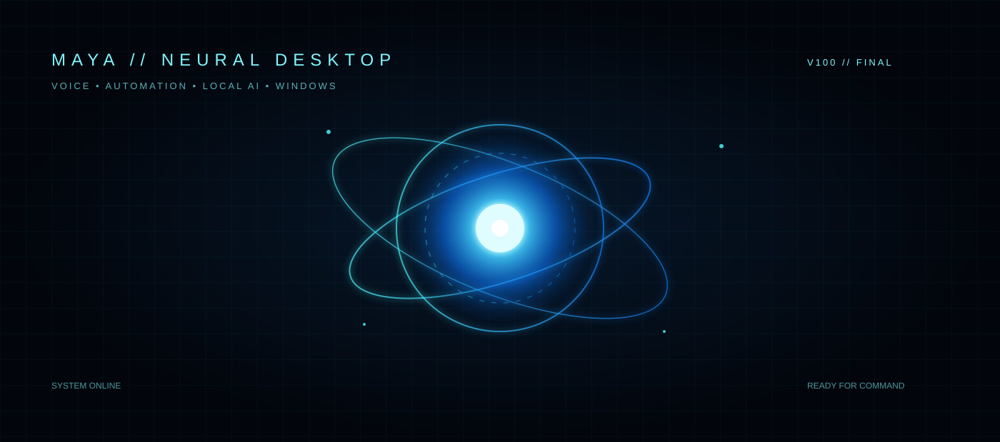

# ◈ MAYA AI — V100

<p align="center">
  
</p>

<p align="center">
  <b>Futuristic voice-controlled desktop assistant for Windows.</b><br/>
  Open apps • launch websites • search • control Windows • speak naturally • optional local Ollama brain
</p>

<p align="center">
  
  
  
  
</p>

## ✦ What is MAYA?

MAYA is a Windows desktop voice assistant designed around a futuristic HUD experience. Speak a command and MAYA routes it through a layered command engine that can launch installed applications, open websites and folders, search the web, control media/system actions, or hand conversational requests to an optional local Ollama model.

> **Goal:** a practical desktop assistant with a sci-fi interface — not a collection of hard-coded demos.

## ⚡ Highlights

| Area | Capabilities |
|---|---|
| 🎙 Voice | Continuous listening, speech recognition, spoken responses |
| 🚀 Launcher | Apps, Start Menu discovery, executables, URLs, folders |
| 🌐 Web | Google search, YouTube search, direct sites |
| 🪟 Windows | Settings, desktop, window switching, screenshots, volume |
| ⌨ Automation | Voice typing, copy/paste, media controls |
| 🧠 Local AI | Optional Ollama integration |
| 🌌 HUD | Animated neural core, orbits, particles, telemetry, command stream |
| 🧩 Skills | JSON skill registry for extending commands |

## 🗣 Example commands

```text
Hey Maya, open YouTube
Open Chrome
Launch VS Code
Open Downloads
Go to GitHub
Search YouTube for linked list in C
Search Google for Java OOP
Take screenshot
Show desktop
Switch window
Volume up
Play music
Type hello world
Open Settings
What time is it?
```

## 🏗 Project structure

```text
MAYA_AI/
├── main.py                 # Futuristic HUD + application entry point
├── config.json             # Assistant configuration
├── requirements.txt        # Python dependencies
├── INSTALL_MAYA.bat        # One-time Windows setup
├── START_MAYA.bat          # Start MAYA
├── run_text_mode.bat       # Text-only fallback
├── LICENSE                 # MIT license
├── .gitignore
│
├── core/
│   ├── commands.py         # Natural command routing
│   ├── launcher.py         # Windows/web/file launching
│   ├── listener.py         # Microphone + speech recognition
│   ├── speaker.py          # Text-to-speech
│   ├── brain.py            # Optional Ollama bridge
│   └── config.py           # Configuration loader
│
├── skills/
│   └── skills.json         # Extensible skill registry
│
└── assets/
    └── maya-hud.svg        # GitHub/project visual identity
```

## 🚀 Quick start

### 1. Clone

```bash
git clone <YOUR_REPOSITORY_URL>
cd MAYA_AI
```

### 2. Install

On Windows, double-click:

```text
INSTALL_MAYA.bat
```

### 3. Start

```text
START_MAYA.bat
```

Or from a terminal:

```bash
python main.py
```

## 🧠 Optional Ollama brain

MAYA can work without Ollama for deterministic desktop commands. If Ollama is installed and configured, conversational requests can be routed to a local model.

Keep the assistant functional even when the local model is unavailable — launcher skills do not depend on the AI model.

## 🔐 Safety

MAYA is intended for your own Windows machine. Review commands before adding new automation skills. Do not place API keys, passwords, tokens, `.env` files, or personal data in the repository.

## 🛠 Customization

Edit `config.json` for voice, wake-word, Ollama settings, and UI preferences. Add or modify entries in `skills/skills.json` when extending the command system.

## 📌 Roadmap

- [x] Voice-controlled application launcher
- [x] Website and search commands
- [x] Windows utility commands
- [x] Futuristic HUD
- [x] Optional local AI bridge
- [x] Extensible skill registry
- [ ] More Windows automation skills
- [ ] Plugin SDK
- [ ] Multi-language voice support

## ⭐ Project

Built as a personal desktop-AI engineering project focused on voice interaction, automation, UI/UX, and local AI.
